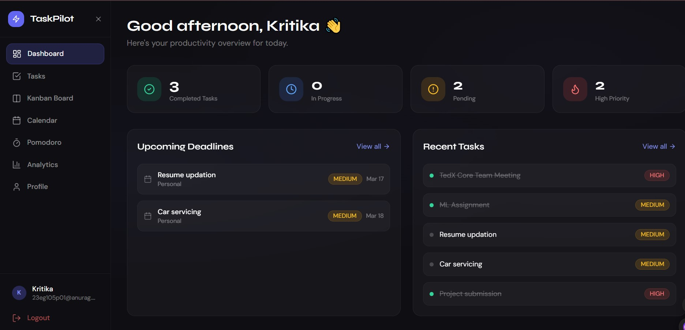
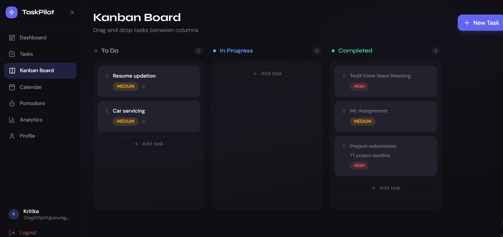

# TaskPilot – Productivity & Task Management Platform

TaskPilot is a full-stack productivity application that helps users manage tasks, deadlines, and study sessions in one place.
It provides tools for organizing work, tracking progress, and improving productivity through visual task boards, calendars, and study timers.

---

##  Features

| Feature | Description |
|---------|-------------|
| 🔐 Authentication | JWT-based secure auth with BCrypt password hashing |
| ✅ Task Management | Full CRUD with priority, deadlines, categories, descriptions |
| 🗂️ Subtasks | Nested task checklists with completion tracking |
| 📋 Kanban Board | Trello-style drag-and-drop board (dnd-kit) |
| 📅 Calendar | FullCalendar integration with monthly/weekly/daily views |
| ⏱️ Pomodoro Timer | 25/5/15 min timer with circular UI |
| 📊 Analytics | Charts for tasks by category, priority, weekly activity |
| 📎 File Attachments | Upload PDFs, images, notes to any task |
| 🏷️ Categories | Custom colored categories per user |
| 🌙 Dark Mode | Sleek dark theme throughout |

---

##  Tech Stack

### Backend
- Java 17
- Spring Boot 3.2
- Spring Data JPA
- MySQL 8
- JWT (jjwt 0.11.5)
- BCrypt password encryption
- Apache Maven

### Frontend
- React 18 + Vite
- Tailwind CSS (dark theme)
- Axios
- React Router v6
- Chart.js + react-chartjs-2
- FullCalendar v6 
- dnd-kit (drag and drop)
- date-fns
- Lucide React icons

---

### Preview

---

